<div align="center">

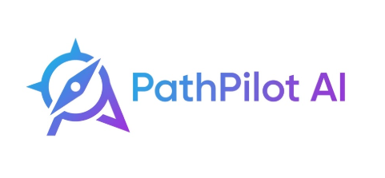

# 🚀 PathPilot AI

### *Turn Your Career Goals into a Personalized AI-Powered Learning Journey*

<p align="center">

An intelligent full-stack career development platform powered by **Google Gemini AI** that helps students, aspiring developers, and professionals build job-ready skills through personalized career roadmaps, AI resume analysis, interview preparation, project generation, and daily learning missions.

</p>

<p align="center">

[](https://pathpilot-ai-jade.vercel.app)

[](https://github.com/habiarif-dev/pathpilot-ai)

</p>

---


</div>

---

# 📖 About PathPilot AI

**PathPilot AI** is a modern AI-powered career guidance platform that transforms career aspirations into structured learning journeys.

Whether you're a beginner exploring web development, a student preparing for technical interviews, or a professional planning your next career move, PathPilot AI acts as your intelligent career companion.

Using the power of **Google Gemini AI**, the platform provides personalised guidance, practical learning plans, resume feedback, interview coaching, project recommendations, and daily missions to help users grow consistently and confidently.

---

# 🎯 Problem Statement

Learning online often feels overwhelming because learners struggle to answer questions like:

- What should I learn next?
- Which projects should I build?
- Is my resume ATS-friendly?
- Am I ready for interviews?
- How do I stay consistent every day?

PathPilot AI solves these challenges by combining multiple AI-powered career tools into one unified platform.

---

# ✨ Core Features

| Feature | Description |
|---------|-------------|
| 🤖 AI Career Assistant | Interactive AI mentor for career guidance and learning support |
| 📄 Resume Analyzer | Analyze resumes with AI and receive ATS-friendly feedback |
| 🧠 Career Assessment | Discover strengths, focus areas and recommended career paths |
| 💡 AI Project Generator | Generate personalised project ideas based on your skills |
| 🎤 Interview Simulator | Practice interviews with AI-generated questions and feedback |
| 🗺️ Career Roadmap | Receive structured learning milestones and weekly plans |
| 🎯 Daily Missions | Stay consistent through AI-generated daily learning tasks |
| 📊 Dashboard Insights | Track your learning progress and recommendations |
| 🌙 Dark & Light Theme | Seamless theme switching with responsive UI |
| 📱 Responsive Design | Optimized for desktop, tablet and mobile devices |

---

# 🌟 Why PathPilot AI?

✔ AI-powered career planning

✔ Personalized learning recommendations

✔ Structured roadmap generation

✔ Resume improvement with ATS insights

✔ Practical project recommendations

✔ Interview preparation

✔ Progress tracking

✔ Daily learning missions

✔ Modern and responsive user interface

---

# 🌐 Live Application

### 🚀 Frontend

https://pathpilot-ai-jade.vercel.app

### ⚙️ Backend

https://pathpilot-ai-backend-x4w8.onrender.com

---

# 📸 Application Preview

### Landing Page

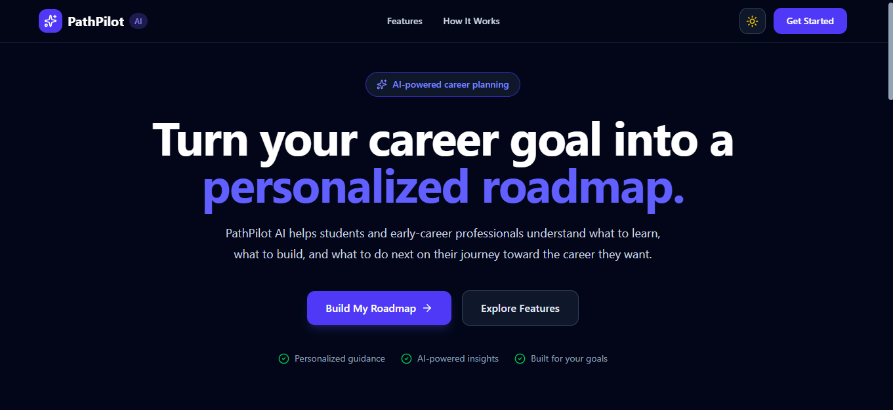

---

### Dashboard

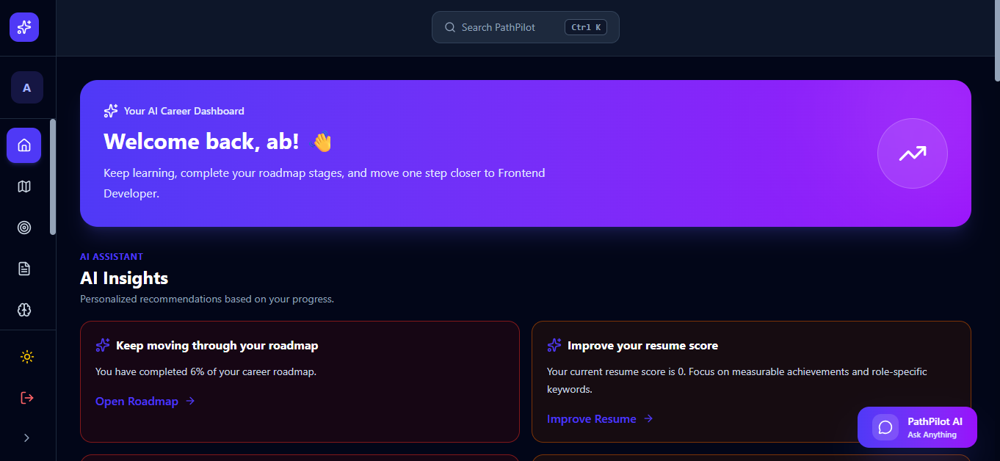

---

# 🤖 AI-Powered Modules

PathPilot AI integrates multiple AI-driven modules to provide a complete career development experience.

---

## 📄 AI Resume Analyzer

Upload your resume to receive an in-depth AI analysis.

### Features

- ATS compatibility score
- Resume strengths & weaknesses
- Missing keywords detection
- Section quality analysis
- Actionable improvement suggestions
- Career-specific recommendations

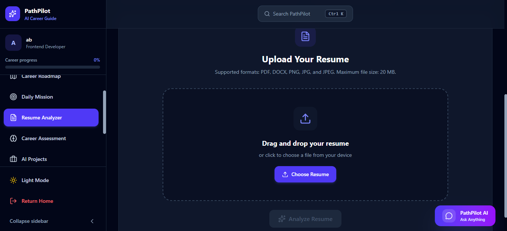

---

## 🧠 Career Assessment

Generate a personalised career profile based on your skills, interests, experience level and learning preferences.

### Features

- AI-generated career profile
- Strength identification
- Focus areas
- Skill gap analysis
- Recommended actions
- Career direction guidance

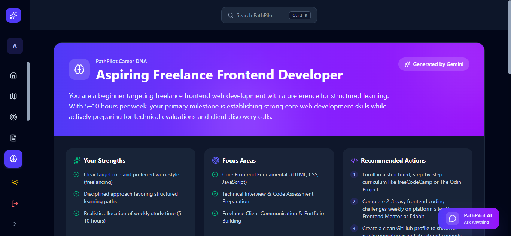

---

## 🗺️ AI Career Roadmap

Generate a personalised learning roadmap designed around your career goals.

### Features

- Monthly milestones
- Weekly learning plans
- Practical projects
- Portfolio building
- Recommended technologies
- Learning resources
- Progress tracking

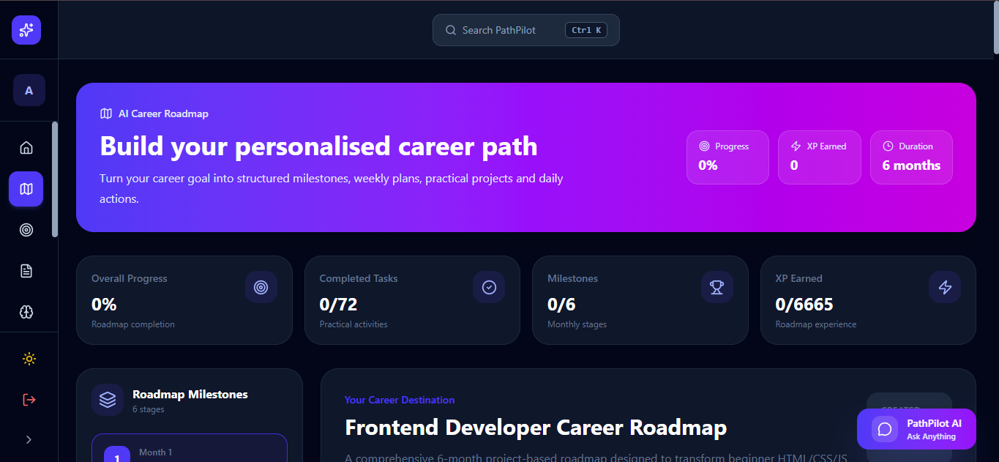

---

## 🎯 Daily Mission Generator

Transform your roadmap into actionable daily tasks.

### Features

- AI-generated daily missions
- XP rewards
- Progress tracking
- Learning streaks
- Career milestone integration

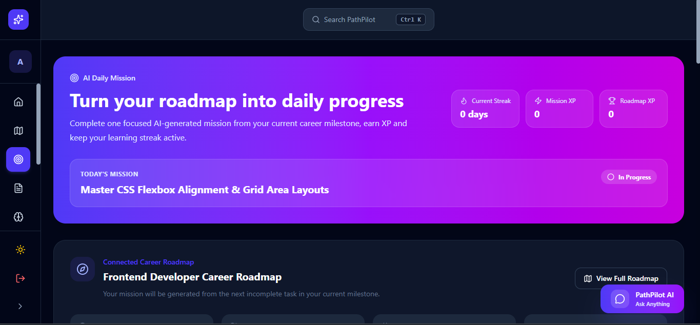

---

## 💡 AI Project Generator

Generate practical portfolio projects tailored to your skills and learning goals.

### Features

- Beginner to advanced projects
- Technology-based filtering
- Difficulty selection
- Project descriptions
- Feature suggestions

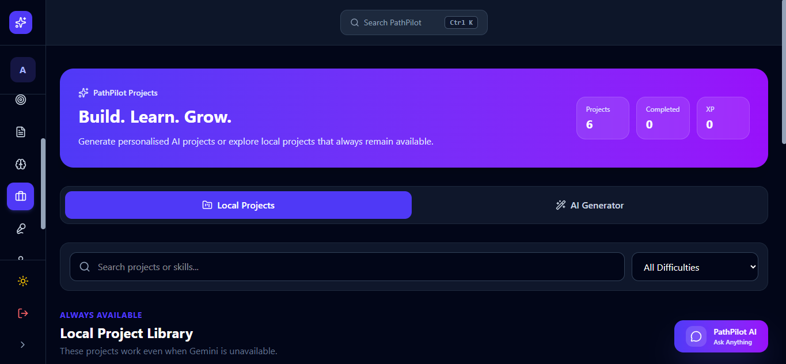

---

## 🎤 AI Interview Simulator

Practice technical interviews with instant AI feedback.

### Features

- AI-generated interview questions
- Performance evaluation
- Answer analysis
- Improvement suggestions
- Interview reports

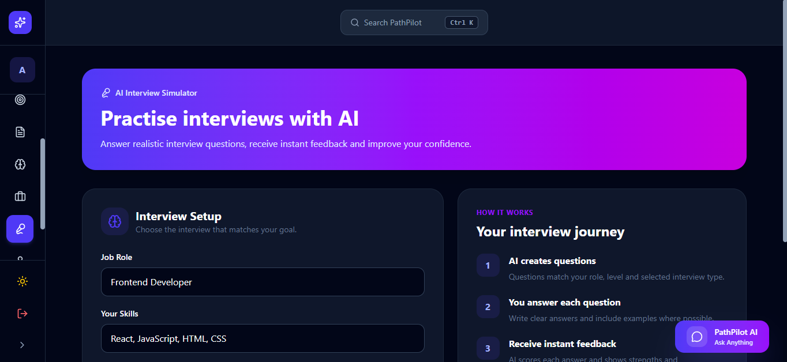

---

## 🤖 AI Career Assistant

Your intelligent career companion that answers questions related to learning, careers, resumes, interviews, freelancing and productivity.

### Capabilities

- Career guidance
- Resume improvement
- Skill recommendations
- Learning advice
- Project suggestions
- Roadmap assistance
- Daily productivity guidance

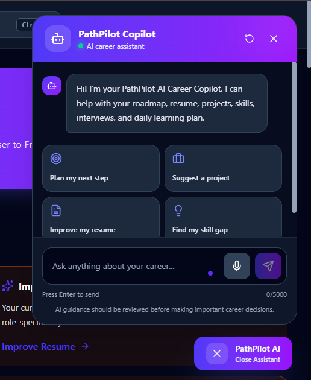

---

# ⚙️ Technology Stack

## Frontend

- React
- Vite
- React Router
- JavaScript (ES6+)
- CSS3
- Responsive Design

---

## Backend

- Node.js
- Express.js
- REST API

---

## Artificial Intelligence

- Google Gemini AI
- Prompt Engineering
- AI Response Processing
- JSON-based AI Outputs

---

## Deployment

| Service | Platform |
|----------|----------|
| Frontend | Vercel |
| Backend | Render |

---

# 🏗️ System Architecture

```text
                    ┌────────────────────┐
                    │     User Browser    │
                    └──────────┬─────────┘
                               │
                               ▼
                    React + Vite Frontend
                               │
                    REST API Requests
                               │
                               ▼
                    Express.js Backend
                               │
                               ▼
                     Google Gemini AI
                               │
                               ▼
                      AI Generated Results
```

---

# 📂 Project Structure

```text
pathpilot-ai/
│
├── server/
│   ├── ai-assistant.js
│   ├── career-assessment.js
│   ├── career-roadmap.js
│   ├── dashboard-insights.js
│   ├── interview-simulator.js
│   ├── project-generator.js
│   ├── resume-analyzer.js
│   ├── index.js
│   └── package.json
│
├── src/
│   ├── components/
│   ├── context/
│   ├── pages/
│   ├── services/
│   ├── App.jsx
│   ├── main.jsx
│   └── index.css
│
├── screenshots/
│
├── public/
│
├── package.json
│
└── README.md
```

---

# 🔒 Security & Best Practices

- Environment variables for API keys
- Backend API separation
- Secure Gemini API integration
- Modular project architecture
- Responsive design
- Clean component structure
- Error handling for AI requests
- User-friendly validation

---

# 🚀 Performance Highlights

- ⚡ Fast Vite development environment
- 🎯 Modular React architecture
- 📱 Fully responsive interface
- 🤖 AI-powered recommendations
- 🌙 Dark & Light themes
- 🔄 Real-time API communication
- 📊 Interactive dashboard
- 🧩 Scalable code structure

---

# 🚀 Getting Started

Follow these steps to run PathPilot AI locally.

---

## 1️⃣ Clone the Repository

```bash
git clone https://github.com/habiarif-dev/pathpilot-ai.git
```

---

## 2️⃣ Navigate into the Project

```bash
cd pathpilot-ai
```

---

## 3️⃣ Install Dependencies

### Frontend

```bash
npm install
```

### Backend

```bash
cd server
npm install
```

---

## 4️⃣ Configure Environment Variables

Create a `.env` file inside the **server** directory.

```env
GEMINI_API_KEY=YOUR_GEMINI_API_KEY
GEMINI_MODEL=gemini-3.6-flash
```

For the frontend, create a `.env` file in the project root:

```env
VITE_API_URL=http://localhost:5000
```

When deploying to Vercel:

```env
VITE_API_URL=https://pathpilot-ai-backend-x4w8.onrender.com
```

---

## 5️⃣ Start the Backend

```bash
cd server
npm start
```

---

## 6️⃣ Start the Frontend

```bash
npm run dev
```

The application will be available at:

```
http://localhost:5173
```

---

# 🌐 Deployment

## Frontend

**Platform:** Vercel

https://pathpilot-ai-jade.vercel.app

---

## Backend

**Platform:** Render

https://pathpilot-ai-backend-x4w8.onrender.com

---

# 📸 Screenshot Gallery

## 🏠 Landing Page


---

## 📊 Dashboard


---

## 📄 Resume Analyzer


---

## 🧠 Career Assessment


---

## 🗺️ Career Roadmap


---

## 🎯 Daily Mission


---

## 💡 AI Projects


---

## 🎤 Interview Simulator


---

## 🤖 AI Career Assistant


---

## ⚙️ Settings

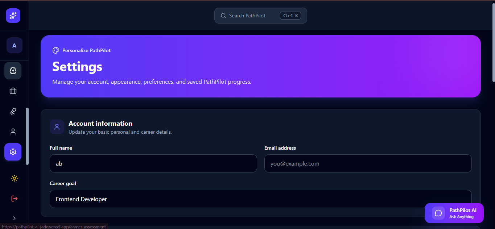

---

# 💻 Core Functionalities

✅ AI Resume Analysis

✅ Career Assessment

✅ Personalized Career Roadmaps

✅ AI Project Generation

✅ Interview Simulation

✅ AI Career Chat Assistant

✅ Dashboard Insights

✅ Daily Missions

✅ Responsive Design

✅ Dark & Light Themes

---

# 🧠 AI Workflow

```text
User Input
     │
     ▼
React Frontend
     │
REST API
     │
     ▼
Express Backend
     │
Google Gemini AI
     │
AI Processing
     │
     ▼
Personalized Response
     │
     ▼
Interactive User Interface
```

---

# 📈 Project Highlights

- 🚀 Full-Stack Architecture
- 🤖 Google Gemini AI Integration
- ⚡ Fast Vite Development
- 🎯 Modular React Components
- 📱 Fully Responsive UI
- 🌙 Dark & Light Mode
- 🔐 Environment Variable Security
- 📊 AI-Powered Career Dashboard
- 🎓 Student-Friendly Learning Experience
- 💼 Career-Focused Productivity Platform

---

# 📌 Use Cases

- Students learning web development
- Fresh graduates preparing for jobs
- Freelancers building portfolios
- Developers improving interview skills
- Professionals planning career growth
- Anyone seeking structured AI-guided learning

---

# 🔮 Future Enhancements

PathPilot AI is designed with scalability in mind. Planned improvements include:

- 🔐 User Authentication (Google & Email Login)
- 👤 Personalized User Profiles
- 📈 Learning Progress Analytics
- 💾 Cloud Data Synchronization
- 📅 Smart Study Planner
- 🏆 Achievement Badges & Rewards
- 📜 AI Progress Reports (PDF Export)
- 💼 Job & Internship Recommendations
- 🌍 Multi-language Support
- 📱 Progressive Web App (PWA)
- 🔔 Smart Notifications & Reminders
- 🤝 Community Learning & Discussion Forum
- 📊 Advanced Dashboard Insights
- 🎓 AI Learning Coach with Adaptive Recommendations

---

# 🤝 Contributing

Contributions are welcome!

If you'd like to improve PathPilot AI:

1. Fork the repository
2. Create a new feature branch

```bash
git checkout -b feature/your-feature-name
```

3. Commit your changes

```bash
git commit -m "Add new feature"
```

4. Push your branch

```bash
git push origin feature/your-feature-name
```

5. Open a Pull Request

Every contribution that improves the project is appreciated.

---

# 🧠 What I Learned

Building PathPilot AI helped me strengthen my skills in:

- Full-Stack Web Development
- React & Component-Based Architecture
- REST API Development
- Express.js Backend Development
- Google Gemini AI Integration
- Prompt Engineering
- API Error Handling
- Environment Variable Management
- Deployment using Vercel & Render
- Git & GitHub Workflow
- Responsive UI/UX Design

This project also enhanced my understanding of integrating AI into real-world web applications.

---

# 🙏 Acknowledgements

Special thanks to:

- **Google Gemini AI** for enabling intelligent AI-powered career assistance.
- **React** and **Vite** for providing a fast and modern frontend development experience.
- **Express.js** for powering the backend APIs.
- **Render** for backend hosting.
- **Vercel** for seamless frontend deployment.
- **Open Source Community** for providing tools and resources that made this project possible.

---

# 📊 Project Status

> **Current Status:** ✅ Production Ready

| Feature | Status |
|---------|--------|
| Resume Analyzer | ✅ Completed |
| Career Assessment | ✅ Completed |
| AI Assistant | ✅ Completed |
| AI Project Generator | ✅ Completed |
| Interview Simulator | ✅ Completed |
| Career Roadmap | ✅ Completed |
| Daily Mission | ✅ Completed |
| Dashboard | ✅ Completed |
| Responsive UI | ✅ Completed |
| Deployment | ✅ Completed |

---

# 👩‍💻 Author

## **Habiba Arif**

Frontend Developer • AI Enthusiast • Lifelong Learner

### 🌐 Portfolio Project

**Live Application**

https://pathpilot-ai-jade.vercel.app

### 💻 GitHub

https://github.com/habiarif-dev

### 📂 Repository

https://github.com/habiarif-dev/pathpilot-ai

---

# ⭐ Show Your Support

If you found this project useful, consider giving it a ⭐ on GitHub.

Your support helps motivate future improvements and encourages open-source collaboration.

---

# 📜 License

This project is licensed for educational and portfolio purposes.

Developed as part of the **ACT AI SkillBridge Final Project** to demonstrate the integration of Artificial Intelligence with modern Full-Stack Web Development.

---

<div align="center">

## 🚀 PathPilot AI

### *Empowering Learners with AI-Driven Career Growth*

**Built with ❤️ using React, Node.js, Express, Vite, and Google Gemini AI**

© 2026 Habiba Arif. All Rights Reserved.

</div>
